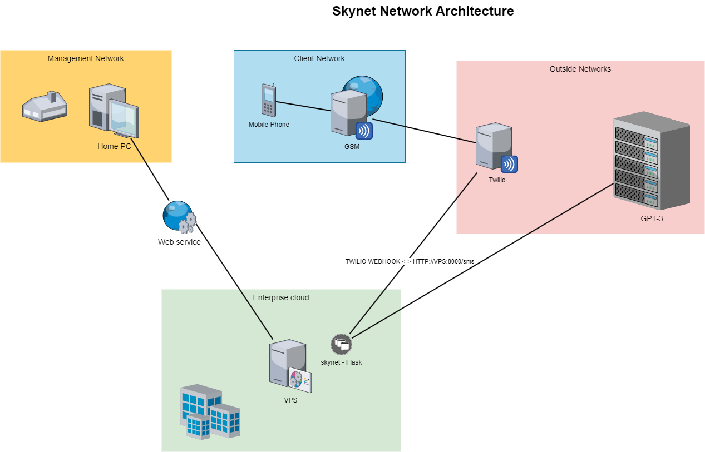

# SKYNET - AI Assistant with Twilio Integration

SKYNET is an AI assistant implemented in Python, utilizing OpenAI's GPT-3 for natural language processing. It includes integration with Twilio for SMS communication.

## Table of Contents

- [Description](#description)
- [Installation](#installation)
- [Usage](#usage)
- [Contributing](#contributing)
- [License](#license)

## Description

SKYNET is a Flask-based AI assistant that leverages OpenAI's GPT-3 to provide conversational responses to SMS messages. It integrates with Twilio for receiving and sending SMS messages, enabling users to interact with the AI assistant via text messages.

The project includes the following components:

- **libgpt.py**: Python module for interacting with OpenAI's GPT-3 API.
- **sms_helper.py**: Module for sending SMS messages using Twilio.
- **skynet.py**: Flask web application handling incoming SMS requests, processing them with GPT-3, and responding via SMS.



## Installation

To install SKYNET and set up the environment, follow these steps:

1. Clone the repository:

```
git clone [<repository_url>](https://github.com/cwinfosec/skynet)
cd skynet
```

2. Install the required dependencies:

```
pip install -r requirements.txt
```

3. Set up environment variables:
   - Obtain an API key for OpenAI's GPT-3 and Twilio.
   - Set environment variables for `OPENAI_API_KEY`, `TWILIO_ACCOUNT_SID`, and `TWILIO_AUTH_TOKEN` with your respective keys.

4. Run the Flask application:

```
python skynet.py
```

## Usage

Once SKYNET is set up and running, users can interact with it by sending SMS messages to the Twilio number configured in the `src_phone` variable within `skynet.py`. SKYNET will process the incoming messages using GPT-3 and respond accordingly.

## License

This project is licensed under the terms of the [MIT License](LICENSE).
``` ````

This Markdown provides an overview of the SKYNET project, including its description, installation instructions, usage guidelines, contribution guidelines, and license information. You can customize it further to include specific details about your project.
